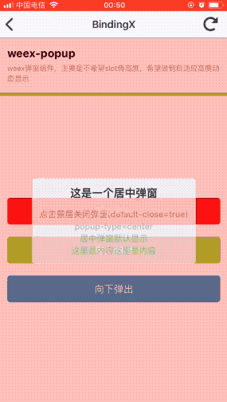

## weex-popup
> weex弹窗组件。支持居中淡入淡出弹窗及向下向上弹出弹窗。




#### 如何使用

安装weex-coms

```
npm install weex-coms -i
//若403无法安装，则切换原有npm，再安装
npm config set registry https://registry.npmjs.org/
```
组件引入
```
import {weexPopup} from 'weex-coms';
```

具体使用代码如下
```html
<template>
  <div class="weex-demo">
    <description title="weex-popup" desc="weex弹窗组件，主要是不希望slot传高度，希望做到自适应高度动态显示"></description>
    <wrapper>
      <com-button bgColor='#f21818' color='#ffffff' @click="showPopup = true" text="居中淡入"></com-button>
      <com-button bgColor='yellowgreen' color='#ffffff' @click="showPopup2 = true" text="向上弹出"></com-button>
      <com-button bgColor='#3c8dbc' color='#ffffff' @click="showPopup3 = true" text="向下弹出"></com-button>
    </wrapper>
    <weex-popup :show-popup="showPopup" @maskClick="maskClick('居中弹窗')" popup-type="center" @hidePopup="showPopup = false" :default-close=true popup-color="rgba(255,0,0,0.6)">
      <div class="popup center">
        <text class="popup__title">这是一个居中弹窗</text>
        <text class="popup__desc">点击蒙层关闭弹窗(default-close=true)</text>
        <text class="popup__desc">popup-type=center</text>
        <text class="popup__desc">居中弹窗默认显示</text>
        <text class="popup__desc">这里是内容这里是内容</text>
      </div>
    </weex-popup>
    <weex-popup :show-popup="showPopup2" @maskClick="maskClick('向上弹出')" popup-type="bottom" @hidePopup="showPopup2 = false" :default-close=false  popup-color="rgba(0,255,0,0.6)">
      <div class="popup bottom">
        <div class="popup-wrapper">
          <text class="popup__title">这是一个向上弹出的弹窗</text>
          <text class="popup__desc">点击蒙层不可关闭弹窗(default-close=false)</text>
          <text class="popup__desc">popup-type=bottom</text>
          <text class="popup__desc">这里是内容这里是内容</text>
          <text class="popup__desc">这里是内容这里是内容</text>
        </div>
        <text class="popup__close" @click="showPopup2 = false">关闭</text>
      </div>
    </weex-popup>
    <weex-popup :show-popup="showPopup3" @maskClick="maskClick('向下弹出')" popup-type="top" @hidePopup="showPopup3 = false" :default-close=true  popup-color="rgba(0,0,255,0.6)">
      <div class="popup top">
        <div class="popup-wrapper">
          <text class="popup__title">这是一个向下弹出的弹窗</text>
          <text class="popup__desc">点击蒙层不可关闭弹窗(default-close=false)</text>
          <text class="popup__desc">popup-type=top</text>
          <text class="popup__desc">这里是内容这里是内容</text>
          <text class="popup__desc">这里是内容这里是内容</text>
        </div>
        <text class="popup__close" @click="showPopup3 = false">关闭</text>
      </div>
    </weex-popup>
  </div>
</template>
<script>
  import weexPopup from '../../components/weex-popup/index.js';
  // import {weexPopup} from 'weex-coms';
  import description from '../components/description/index.js'
  import wrapper from '../components/wrapper/index.js'
  import comButton from '../components/com-button/index.js'
  const modal = weex.requireModule('modal');
  export default {
    components: { 
      weexPopup,
      description,
      wrapper,
      comButton
    },
    data: {
      showPopup: true,
      showPopup2: false,
      showPopup3: false
    },
    methods: {
      maskClick(str) {
        modal.toast({
          message: `${str}蒙层点击`,
          duration: 0.2
        })
      }
    }
  };
</script>

<style lang="less" scoped>
.weex-demo{
  flex: 1;
}
.popup{
  background-color: #ffffff;
  align-items: center;
  &__title{
    font-size: 36px;
    font-weight: bold;
    margin-bottom: 24px;
  }
  &__desc{
    font-size: 28px;
    color: #aaa;
    line-height: 40px;
  }
  &__close{
    height: 88px;
    line-height: 88px;
    border-top-color: #ccc;
    border-top-width: 1px;
    border-top-style: solid;
    width: 750px;
    text-align: center;
    margin-top: 24px;
  }
  &-wrapper{
    align-items: center;
  }
}
.center{
   padding: 24px;
   width: 540px;
   border-radius: 10px;
}
.bottom{
  width: 750px;
  padding: 24px 24px 0;
  justify-content: space-between;
  align-items: center;
}
.top{
  width: 750px;
  padding: 24px 24px 0;
  justify-content: space-between;
  align-items: center;
}
</style>
```
#### 可运行页面进行查看效果
至于如何运行安装及查看页面可看[前一页](../../README.md)

```
weex-previewer examples/popup/index.vue
```

#### 为啥要再次分装？
[weex-ui](https://alibaba.github.io/weex-ui/#/cn/)里其实已经有[popup](https://alibaba.github.io/weex-ui/#/cn/packages/wxc-popup/)组件了，使用也很简单。但是遇到了一个比较麻烦的问题就是，要准确传入`height`，这个就导致如果弹窗主体内容的高度是自适应的时候，需要先获取内容的高度，准确给`wxc-popup`赋值`height`才行，所以`weex-popup`主要的功能点就是不用传入`height`。具体用法如下:
```html
<template>
  <div>
    <wxc-button text="Open Popup"
                @wxcButtonClicked="buttonClicked">
    </wxc-button>
    <wxc-popup height="500"
               pos="bottom"
               :show="isShow"
              @wxcPopupOverlayClicked="overlayClicked">
    </wxc-popup>
  </div>
</template>

<script>
  import { WxcButton, WxcPopup } from 'weex-ui';
  module.exports = {
    components: { WxcButton, WxcPopup },
    data: () => ({
      isShow: false
    }),
    methods: {
      buttonClicked () {
        this.isShow = true;
      },
      overlayClicked () {
        this.isShow = false;
      }
    }
  };
</script>
```
#### 首先的问题就是，为什么一定要传入一个高度呢？
> 核心原因就在于weex中单位不支持百分比

大家可以想下在h5中我们要一个元素的移入和移出的效果怎么写。以下是我封装h5的弹窗的代码(截取样式的一部分)

```css
.popup{
    position: fixed;
    top: 0;
    right: 0;
    bottom: 0;
    left: 0;
    z-index: 10000;
    background-color: rgba(0,0,0,0.6);
    transition: all 0.3s ease;
    &[data-type='top']{
        .popup-content{
            top: 0;
            left: 0;
            z-index: 3000;
            transition: all 0.3s ease;
        }
        &.fade-leave-active{
            background-color: rgba(0,0,0,0.6);
            .popup-content{
                opacity: 1;
                transform: translateY(0);
            }
        }
        &.fade-leave-to{
            background-color: rgba(0,0,0,0);
            .popup-content{
                opacity: 0;
                transform: translateY(-100%);
            }
        }
        &.fade-enter-active{
            background-color: rgba(0,0,0,0);
            .popup-content{
                opacity: 0;
                transform: translateY(-100%);
            }
        }
        &.fade-enter-to{
            background-color: rgba(0,0,0,0.6);
            .popup-content{
                opacity: 1;
                transform: translateY(0);
            }
        }
    }
    &-content{
        position: absolute;
    }
}
```
核心就是利用了`transition`和`transform`，大家注意，我们利用了`100%`，这样我们就不用在乎元素的高度是多少，当一个置于订部的元素，我们给加上`transform: translateY(-100%);`，元素就会完全移出屏幕，然后在配合`transition`，就可以达到我们想要的移入移出的效果。

那weex中呢，首先的局限就在于无法用百分比，所以偏移量只能写明确的像素，所以这也是为什么weex-ui要暴露一个`height`参数，需要明确指定高度。

似乎传高度也没有什么问题，好多时候弹窗设计出来的时候高度就是固定的。但是如果弹窗高度是自适应的呢，这个高度该如何获取？如果弹窗的内容是后端控制的呢？

#### 所以尝试做了封装
实现的过程（拿置底向上弹出的弹窗为例）
- 获取主内容的高度h 
- 进行h高度的正向偏移使其离开屏幕 
- 用animation进行tranition动画使其向上淡出

1. 获取主内容的高度h
```javascript
//...
const getHeight = () => new Promise((resolve) => {
    // center类型无需获取高度，用flex布局就可以让自适应的内容居中
    // initFlag 用于只获取一次高度，防止重复获取
    if (!this.initFlag && this.popupType !== 'center') {
        this.initFlag = true;
        dom.getComponentRect(this.$refs.popupContent, (option) => {
            if (option.result) {
                this.contentHeight = option.size.height;
                // 不能立马resolve，先让元素进行h高度的偏移离开屏幕
                setTimeout(() => {
                    resolve();
                }, 30);
            }
        });
    } else {
        resolve();
    }
});
//...
```

2. 进行h高度的正向偏移使其离开屏幕
```javascript
<div :class="['weex-popup_content','weex-popup_content_'+popupType]" :style="computedStyle" ref="popupContent" @click.stop>
    <slot></slot>
</div>
...
computed: {
    computedStyle() {
        if (this.popupType === 'bottom') {
            return {
                transform: `translate(0px, ${this.contentHeight}px)`,
            };
        }
        if (this.popupType === 'top') {
            return {
                transform: `translate(0px, ${-1 * this.contentHeight}px)`,
            };
        }
        return {};
    },
},
...
```
3.用animation进行tranition动画使其向上淡出
```
...
let resObj = {
    popupMask: this.$refs.popupMask,
    popupContent: this.$refs.popupContent,
    maskStyle: {
        opacity: +flag,
    },
    contentStyle: {
        opacity: +flag,
    },
};
...
animation.transition(resObj.popupMask, {
    styles: resObj.maskStyle,
    duration: 500,
    timingFunction: 'ease',
}, () => {
    this.showInCurrent = flag;
});
getHeight().then(() => {
    animation.transition(resObj.popupContent, {
        styles: resObj.contentStyle,
        duration: 300,
        timingFunction: 'ease',
    });
});
```

#### 细心的同学会发现这边用的是setTimeout，可能会有疑问，为啥不用nextTick?
>因为实际使用发现nextTick会不准，跟weex的渲染机制有关，因为真正渲染的是原生的元素，vue中的nextTick是把回掉放在微任务队列中（支持promise的情况下），放在渲染函数之后。可是这一套渲染机制放在weex中就不适用了。所以这边也是踩了好几次的坑，最后得出的结论，是`30s`。


#### showInCurrent这个参数的作用是？
> 因为主内容整个用`v-if='showPopup'`包裹，当关闭弹窗的时候，我们希望弹窗消失是淡出（居中），或者移出（向上或者向下）的，而不是直接关闭掉的，所以这里引入了另一个参数showInCurrent，可以把它理解为当前状态弹窗是否可显示。

showInCurrent的状态变更过程
- 当弹窗打开时`showPopup=true`,`showInCurrent`会在动画执行完成被置成`true`
- 当弹窗关闭时`showPopup=true`，由于现在`showInCurrent`为`true`所以弹窗一直显示，当动画执行完成，再把改成置成`false`,整个弹窗就关闭了

#### weex-popup待优化
> 当然待优化的点还有很多，这块我会尽量持续更新，大家有什么issue或者希望扩展的需求可以提，以下几点会持续去完成

- [ ] 支持h5版本(目前只支持在客户端中使用即native)
- [ ] 参数的扩展，如：动画的执行时间、`timingFunction` 等
- [ ] 性能的检测和优化
- [ ] 向左向右出的弹窗？


